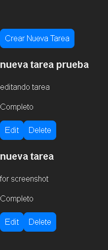

************TAREAS FOR IT***********

*******EN CARPETA BACKEND********
npm init
npm install cors express uuid 

para levantar el servidor npm run start

apis en endpoint pedidos en PDF solicitado
todos los datos de las tareas son guardados en un archivo json en la carpeta data

*********EN CARPETA FRONTEND*********
npm init 
npm install react react-dom react-router-dom

para levantar el proyeco npm run dev

las apis son consumidas desde el backend para su posterior utilizacion usando FETCH

*************************
adjunto fotos: 
******* tarea renderizada*********

****** formulario creacion ***********

*******renderizacion nueva tarea *********

******* formulario de edicion ********

******** renderizacion tarea editada **********

